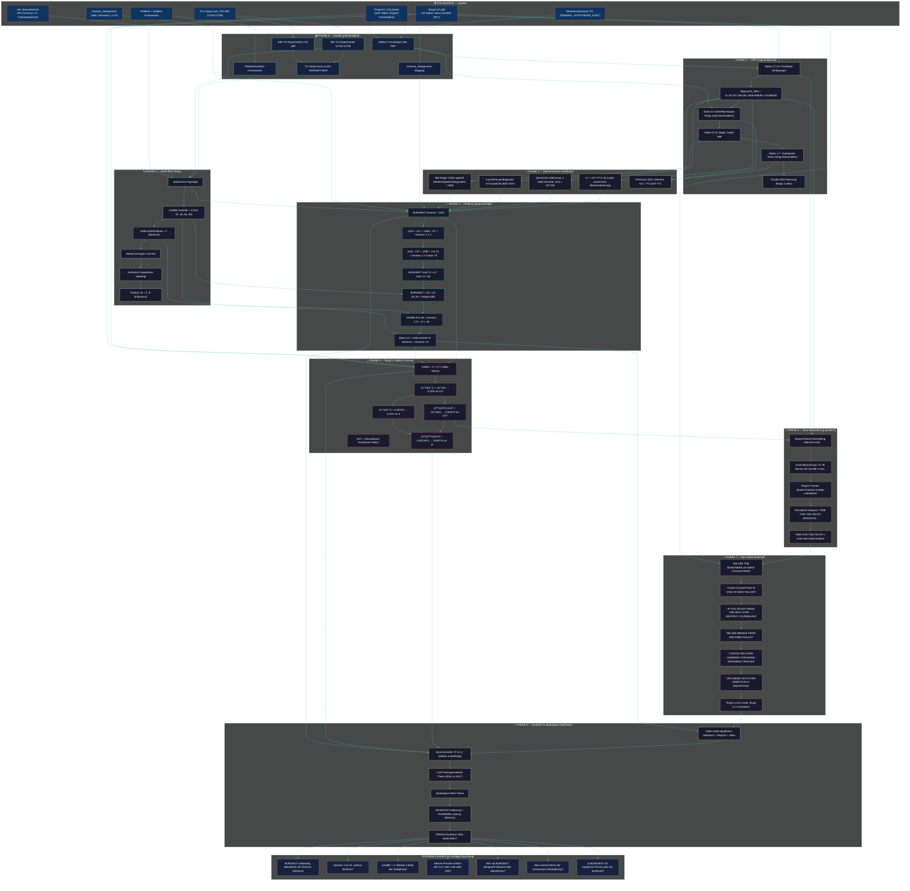

# 🔬 TENGRI 137 — Mermaid Investigations-Plan

**Modus:** PhiMind — wachsend, nicht-revidierend
**Letzte Aktualisierung:** 2026-06-30

## Wie dieser Plan zu lesen ist

1. **Foundation (oben):** Die 7 unabhängigen Quellen
2. **Phase 0:** Vollständigkeit — wir haben alle Dokumente kopiert
3. **Phase 1:** BURUMUT — Struktur, nicht Bedeutung
4. **Phase 2:** PDF-Original — was wirklich drin steht
5. **Phase 3:** Mathematik — was numerisch hält
6. **Phase 4:** Genesis-Bridge — die zentrale Entdeckung
7. **Phase 5:** YHWH-π — Tengri's „heilige Mathematik"
8. **Phase 6:** Atom-Dekodierung — dcode.fr-Schlüssel
9. **Phase 7:** Die Botschaft — was die „Designer" sagen
10. **Phase 8:** Synthese — drei Spiegelungen, eine Wahrheit
11. **Offen:** Was wir noch nicht wissen

## Hinzufügungen

Jede neue Entdeckung wird hier als zusätzlicher Knoten ergänzt, **ohne bestehende zu revidieren**. Dies ist ein wachsender Wissensgraph.